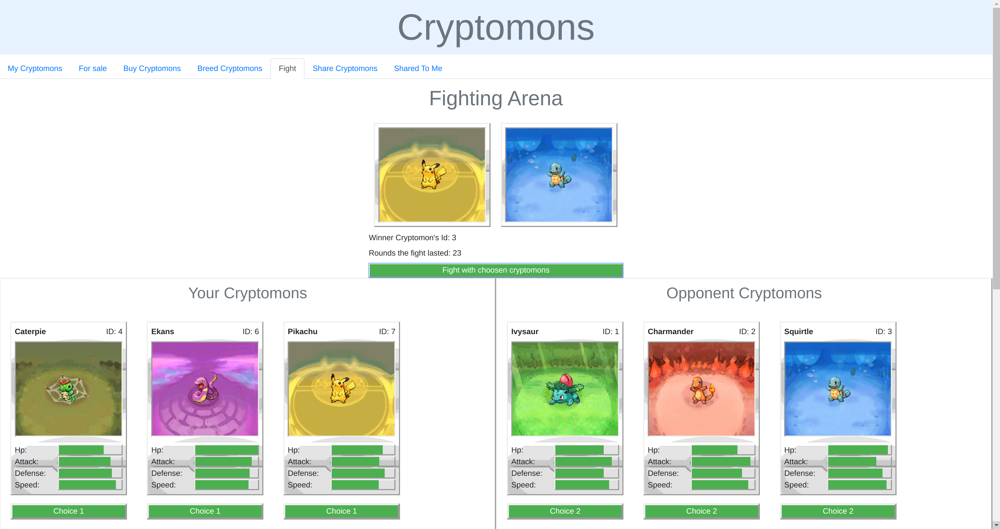
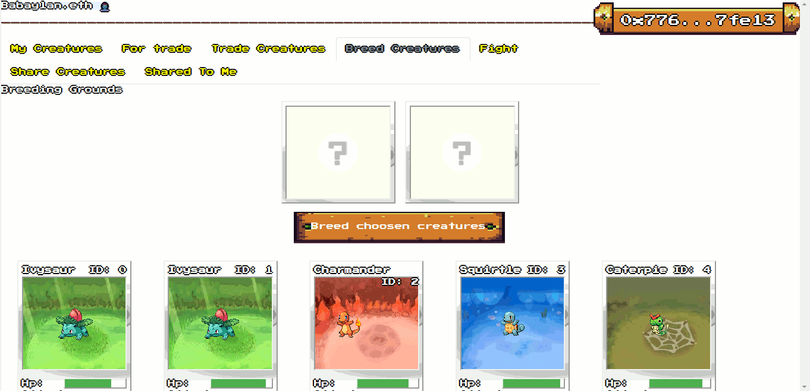

# Babaylan.eth: A DApp Collectible Card Game featuring mythical creature nfts, token currency for the 2d adventure game, for eth-based networks.

<!-- 
 -->
 

***

This project was developed as a module coursework.

Thanks to Stamatis Kourkotas from

**Imperial College London:** MSc in Computing (Software Engineering) 
**Module:** Principless of Distributed Ledgers 
**Project Description:** Found in included [report](./report.pdf) 

This project was bootstrapped with [Create React App](https://github.com/facebook/create-react-app).

## Steps for deployment and use of our DApp

- Firstly, deploy our smart contract found in src/contract.sol (babaylan.eth.sol). We tested this localy on a private blockchain using [Ganache](https://www.trufflesuite.com/ganache)
- In the main file of our user interface src/App.js specify the address where you deployed the contract in the constant CONTRACT_ADDRESS.
- Install the [metamask](https://metamask.io/) extension on your browser to handle your provate blockchain account. the project has been tested with the Chrome and Mozilla browsers.
- In the project directory run:

    **`npm install`** This installs all the necessary dependencies to build our application
    
    **`npm start`** This runs the app in development mode. 

- Open [http://localhost:3000](http://localhost:3000) to view it in the browser. You can see all the Cryptoships owned by the current metamask account and play the game.

## Remaining Tasks

- Change naming e.g. cryptoShips to babaylan.eth...
- Change game context,rules,arts,etc from spaceships to mythical creatures
- Improve or re-design breeding function
- Improve or re-design fighting function
- Add token/ erc20, tokenomics, etc
- Add nft/ erc721
- Add 2d/3d game with token and nfts as game currencies
- Deploy to matic, bsc, moonbeam or ethereum-compatible test networks
- Deploy to matic, bsc, moonbeam or ethereum-compatible main networks
